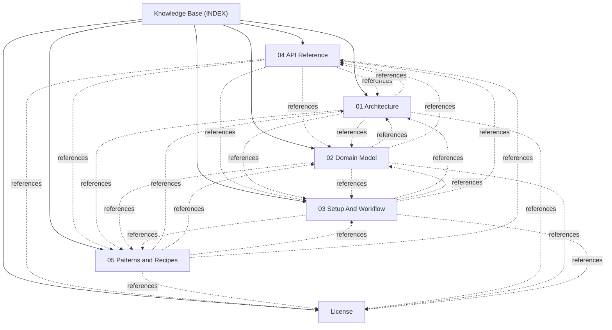

# Knowledge Base Topic Index

Central entry point and cross-linked topic catalog for project documentation:

## Knowledge Graph & Topic Map

---

## Articles

- **[04 API Reference](./topic--04-api-reference.md)** (topic) `04-api-reference`, `api`, `modules`
- **[05 Patterns and Recipes](./topic--05-patterns-and-recipes.md)** (topic) `05-patterns-and-recipes`, `patterns`, `recipes`
- **[01 Architecture](./topic--architecture.md)** (topic) `architecture`
- **[02 Domain Model](./topic--domain-model.md)** (topic) `domain-model`
- **[License](./topic--license.md)** (license) `license`, `proprietary`
- **[03 Setup And Workflow](./topic--setup-and-workflow.md)** (topic) `setup-and-workflow`

---

## Related Context

- [AGENTS.md](../AGENTS.md): Active protocol conventions and rules.
- [.along/DECISIONS.md](../.along/DECISIONS.md): Architectural Decision Records.
- [.along/ISSUES.md](../.along/ISSUES.md): Active issue tracking board.
- [.along/HISTORY.md](../.along/HISTORY.md): Append-only project history log.
